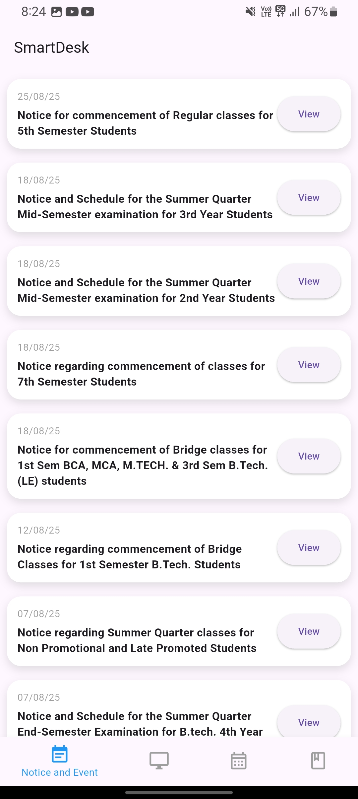
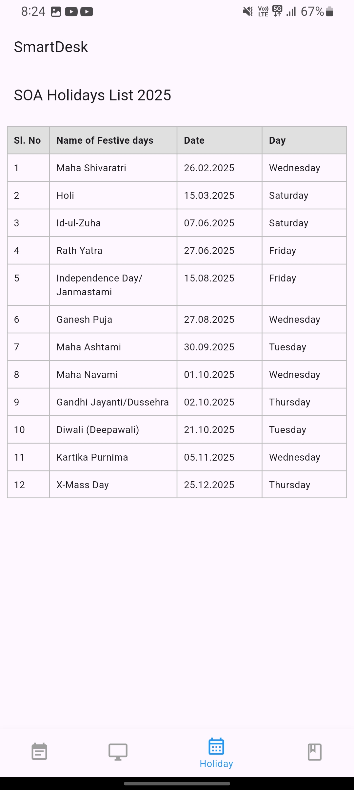

<p align="center">
  
</p>


SmartDesk is a Flutter-based mobile application designed to simplify access to important student resources at **ITER (SOA University)**.  
It collects notices, events, holidays, and curriculum information, and displays them in a clean, material-themed user interface.  

---

<p align="center">
  <a href="https://github.com/imtiyazallam07/SmartDesk/releases/download/v1.5.2/SmartDesk-v1.5.2.apk"></a>
<p>

## ✨ Features  

- **Notices & Events**  
  - Automatically fetches ITER notices and events.  
  - Displays them in a simple, card-based layout with quick access buttons.  

- **Curriculum**  
  - Organized curriculum access for B.Tech (2020–2024 admission batches) and MCA students.  
  - Expandable sections for quick navigation.  

- **Holiday List**  
  - Complete list of SOA holidays with date and weekday.  
  - Tabular format for clarity.  

- **Academic Calendar**
  - Shows year wise academic calendar

---

## 📸 Screenshots  
  
    
 

---

## 🛠️ Built With  
- [Flutter](https://flutter.dev/) – Cross-platform UI toolkit  
- [Dart](https://dart.dev/) – Programming language  
- [Material Design](https://m3.material.io/) – UI design system  

---

## 📦 Installation  

1. Clone the repository:  
   ```bash
   git clone https://github.com/imtiyazallam07/smartdesk.git
   cd smartdesk
   ```


